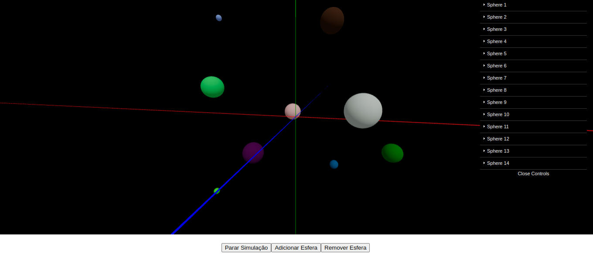

# three-body-problem
Status: Em desenvolvimento.

O problema dos três corpos é um desafio clássico da mecânica celeste que consiste em determinar o movimento de três corpos massivos (como planetas, estrelas ou luas) sob a influência mútua da gravidade. Embora seja possível resolver o problema para dois corpos (como a órbita de um planeta em torno de uma estrela) de forma exata, o comportamento de três corpos interagindo gravitacionalmente é extremamente complexo e caótico.

Ao contrário do problema de dois corpos, para o qual existem soluções analíticas (fórmulas exatas), o problema dos três corpos não tem uma solução geral conhecida. As trajetórias desses corpos podem ser altamente imprevisíveis e dependentes das condições iniciais, resultando em um comportamento que é sensível a pequenas perturbações. Isso torna o sistema caótico e requer métodos numéricos para obter soluções aproximadas em muitas situações.

Esse projeto tenta mostrar as relações gravitacionais entre três corpos e verificar a posição e velocidade desses corpos ao longo do tempo.



## Requisitos

- Git
- NodeJs + NPM

## Como executar

Abra um terminal no seu computador e baixe este repositório.
```
git clone https://github.com/Daniel-Alencar/three-body-problem
```
Navegue até a pasta do projeto.
```
cd three-body-problem
```
Instale as dependências dos pacotes NodeJs.
```
npm install
```
Execute a aplicação em modo de desenvolvimento.
```
npm run dev
```
Pronto! A aplicação já deve estar rodando em sua máquina!